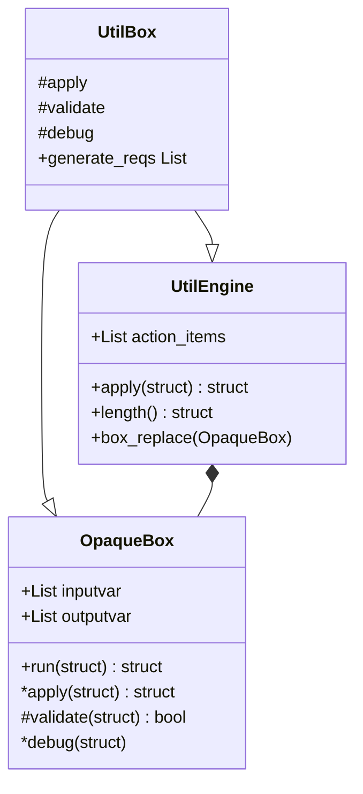

# Summary

The MATLAB plugin pattern is an implementation of a plugin pattern in MATLAB. This repository is meant to be used as a framework for projects where Research and Development is the main focus.
Although, Machine Learning is rapidly phasing out the classical algorithm development, there is still a intermediary step before, ML/AI is integrated into existing systems. This repository is meant to act as a experiment manager for classical algorithm development.
  
# Objectives

This repository attempts to :
- Reduce rework of algorithms
- Reduce unecessary branching
- Keep track of all experimental
- Keep track of experimental code
- Allow for integration with Digital Models
- Provide easy access to Distributed Computing Capabilities
- Provide MATLAB with an import structure that is uniform and concise

# Background
The following section describes vocabulary used with in the repository and the ideas that govern each object.

## Core Idea
`common.OpaqueBox` - This class defines the basic building block of the system.

`common.UtilEngine` - This class contains multiple `OpaqueBox` and runs them in sequence in it's list.

`common.UtilBox` - This class inherits both `OpaqueBox` and `UtilEngine` to act as a larger function block.
 

## Imports
TODO : Document Importer.

## Plugins
TODO : Document Plugins.

# How to use
TODO: Document Usuage.

# Testing
TODO : Document Testing.
